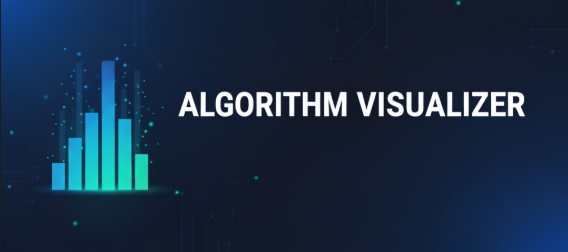
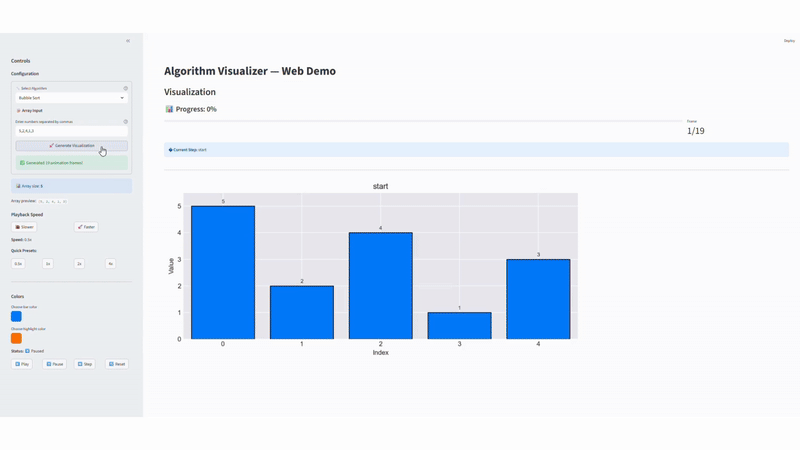

<a name="top"></a>

<div align="center">
  
</div>
<br/>

<div align="center">
  <h1>
    Algorithm Visualizer
  </h1>
  <p>
    A minimal, extensible Python Algorithm Visualizer with a Streamlit web UI, perfect for learning and teaching.
  </p>
  
  <a href="https://github.com/your-username/your-repo/stargazers">
    
  </a>
  <a href="#">
    
  </a>

</div>

---

### ## 📝 Project Overview

This repository contains simple Python implementations of common algorithms (sorting, searching, and pathfinding) along with visualizers to see them in action. The project uses Streamlit to provide an interactive web UI for easy demonstration. It's designed for **learning, teaching, and experimentation** and is a beginner-friendly project for Hacktoberfest!

---

### ## ✨ Features

* Lightweight algorithm implementations with generator-based frame output for visualization.
* Interactive web demo built with Streamlit (`main.py`).
* Example CLI/demo scripts under the `examples/` directory.
* A small test suite for core algorithms using Pytest.
* Beginner-friendly and Hacktoberfest ready! 🎃

---

### ## 🧠 Algorithms Implemented

This project visually demonstrates the following algorithms:

| Algorithm          | Description                                                    | Time Complexity |
| ------------------ | -------------------------------------------------------------- | --------------- |
| **Bubble Sort** | A simple sorting algorithm that repeatedly steps through the list. | `O(n²)`         |
| **Insertion Sort** | Builds the final sorted array one item at a time.              | `O(n²)`         |
| **Selection Sort** | Repeatedly finds the minimum element and moves it to the front. | `O(n²)`         |
| **Binary Search** | An efficient algorithm for finding an item from a sorted list.   | `O(log n)`      |
| **BFS Pathfinding**| A Breadth-First Search demo for grid-based pathfinding.        | `O(V + E)`      |

[Back to Top](#top)

---

### ## 🚀 Live Demo

🚧 *Coming Soon* — stay tuned for the hosted Streamlit demo link!  

> 💡 Want to help host or improve the demo? Contribute a PR in `docs/`!

---

### ## 🎬 Demo Preview  

Here's a quick look at the visualizer in action:



[Back to Top](#top)

---

### ## 🛠️ Installation & How to Run Locally

Follow these steps to get the project running on your local machine.

1.  **Clone the repository**
    ```sh
    git clone [https://github.com/](https://github.com/)[YOUR_GITHUB_USERNAME]/[REPOSITORY_NAME].git
    ```
2.  **Navigate to the project directory**
    ```sh
    cd [REPOSITORY_NAME]
    ```
3.  **Create and activate a virtual environment**
    ```sh
    # Create the venv
    python -m venv .venv
    
    # Windows
    .\.venv\Scripts\Activate.ps1

    # macOS/Linux
    source .venv/bin/activate
    ```
4.  **Install dependencies**
    ```sh
    pip install -r requirements.txt
    ```
5.  **Run the Streamlit Visualizer**
    ```sh
    streamlit run main.py
    ```
    Now, open your browser to the local URL provided by Streamlit to see the application running.

[Back to Top](#top)

---

### ## 🧠 Project Layout

├── algorithms/       # Core algorithm implementations
├── visualizers/      # Visualization helpers
├── examples/         # CLI demos
├── tests/            # Unit tests
├── docs/roadmap.md   # Contribution guide & roadmap
├── main.py           # Streamlit app
└── requirements.txt  # Dependencies

### ## 🧩 How It Works

Each algorithm yields "frames" for visualization:
{
    'state': [5, 2, 4, 1, 3],
    'highlight': (i, j),
    'info': 'Comparing index i and j'
}
The Streamlit app renders these frames as bar charts, with playback speed adjustable by slider.

---

### ## 🙌 How to Contribute

Contributions are what make the open-source community such an amazing place to learn, inspire, and create. Any contributions you make are **greatly appreciated**. Don't forget to give the project a star! ⭐

1.  Fork the Project
2.  Create your Feature Branch (`git checkout -b feature/AmazingFeature`)
3.  Commit your Changes (`git commit -m 'Add some AmazingFeature'`)
4.  Push to the Branch (`git push origin feature/AmazingFeature`)
5.  Open a Pull Request

### ## 📜 License

This project is open-source. See LICENSE for details.

[Back to Top](#top)